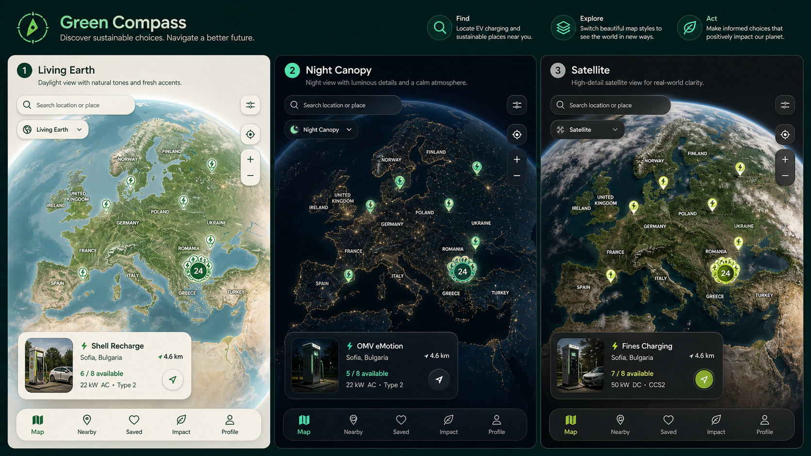
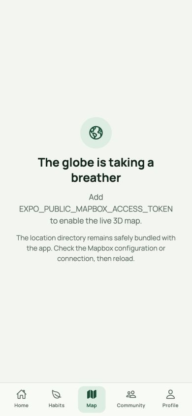
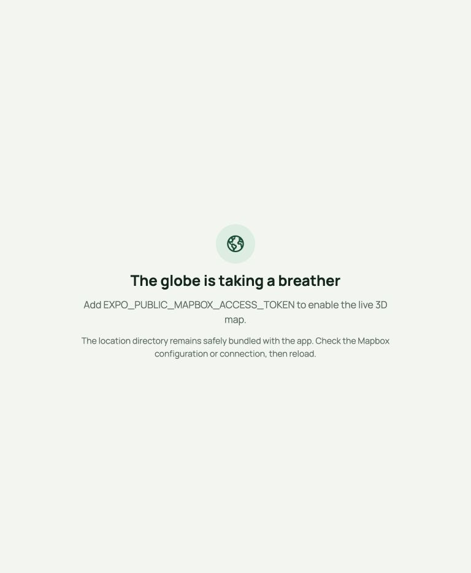
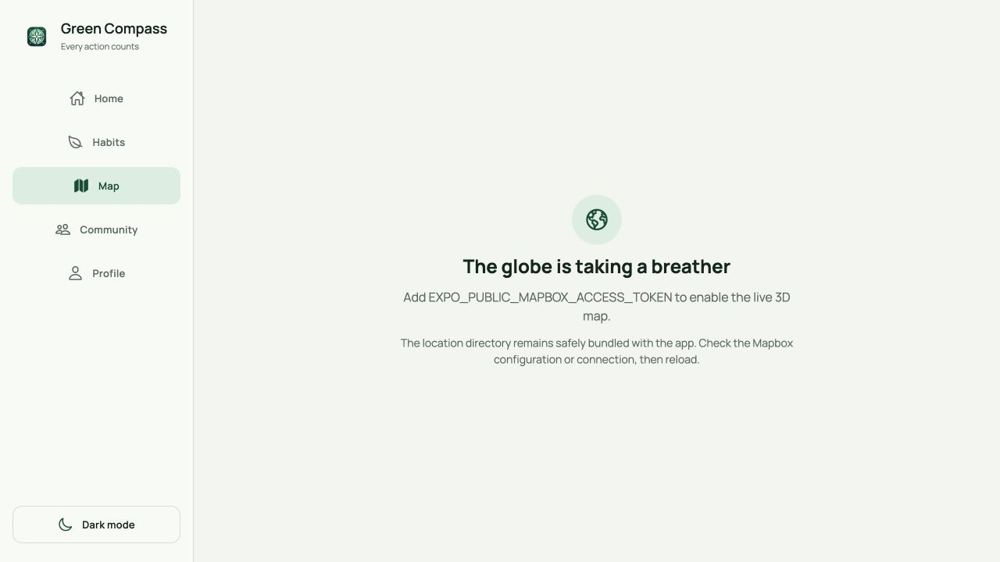

# Sustainability Map 3D Globe

## Product contract

`/map` is a public, unauthenticated discovery experience. It opens on a
Europe-centred 3D globe with Bulgaria visible as an aggregate cluster. The map
contains exactly the 89 licensed EV charging locations currently bundled in
`assets/data/locations_ev_bulgaria.json`; it does not claim the historical
150-location or six-category targets. Available filters are derived from the
dataset, so only **EV Charging** is currently shown.

The feature reuses the existing location model, dataset, Open Charge Map
attribution, geolocation, external navigation, app shell, theme, and route. It
replaces the former Leaflet/WebView renderer, injected HTML, global browser
state, marker utilities, and Sofia-first interface.



The concept board is the visual contract for the three runtime presets. The map
data and controls shown in the application are sourced from the verified local
dataset; the illustrative provider/location names in the board are not data.

### Responsive unavailable-state captures

These token-free captures verify that the public route and failure treatment
remain inside the same responsive app shell. Live globe screenshots are a
release-gate artifact once the public runtime token is configured.

| Mobile (390px) | Tablet (768px) | Desktop (1440px) |
| --- | --- | --- |
|  |  |  |

## Architecture

The shared controller in `src/context/MapContext.tsx` owns one location load and
all application state: query, dynamic filters, visible and ordered results,
viewport, selected location, style, panel state, user location, failures, and
typed camera commands. Pure data transforms live in `src/utils/mapGlobe.ts`.

Both renderers implement `MapRendererProps` from `src/types/map.ts`:

- `GlobeRenderer.web.tsx` uses the exact `mapbox-gl@3.27.0` browser runtime.
  Expo 52 Metro cannot transform Mapbox 3.27's runtime worker import, so the
  adapter loads Mapbox's official versioned JS/CSS distribution and converts
  download failures into the shared unavailable state. The browser runtime is
  intentionally not installed as an npm package because RNMapbox 10.2.10 has
  an optional peer constraint on Mapbox GL JS 2.x; keeping the exact 3.27 CDN
  runtime avoids that unused-package conflict during clean npm/Vercel installs.
- `GlobeRenderer.native.tsx` uses `@rnmapbox/maps@10.2.10`.
- Both receive one GeoJSON `FeatureCollection`, use provider-side clustering,
  and emit the same ready, error, camera, pin, and cluster events.

Search is local, case- and diacritic-insensitive across name, town, address, and
postcode. Without a query, the result surface contains filtered locations in
the current viewport, nearest to camera centre first. With a query, matching
locations across the entire dataset are returned. Filtering and search only
change the GeoJSON data; they never reload the source dataset.

## Responsive interaction

- Desktop/tablet: full map inside the app shell, collapsible left results rail,
  floating search/style/filter/locate controls, and a right detail drawer.
- Mobile: full map above bottom navigation, compact controls, results bottom
  sheet, and a detail sheet with a back-to-results action.
- Cluster selection flies to its expansion zoom. Reduced-motion users get an
  immediate camera change.
- Style changes preserve camera, filters, query, selected pin, and panels.
- Locate-me creates a user location puck. Permission/network failures appear as
  an accessible toast for four seconds.
- Coverage messaging is hidden at the Europe overview and only appears at
  detailed zoom outside Bulgaria or after an out-of-area locate.
- Controls expose accessible labels, keyboard focus, and at least 48px targets.

## Runtime styles

| ID | Base | Environment | Pin treatment |
| --- | --- | --- | --- |
| `living-earth` | Mapbox Standard | daylight, soft atmosphere | Green Compass emerald |
| `night-canopy` | Mapbox Standard | night lighting, dark chrome | emissive mint |
| `satellite` | Mapbox Standard Satellite | satellite terrain | high-contrast lime |

`living-earth` is the first-visit default. The selected style is persisted in
AsyncStorage. The style picker includes a distinct thumbnail swatch for every
preset.

## Credentials and development builds

Set a public, origin-restricted token at runtime:

```bash
EXPO_PUBLIC_MAPBOX_ACCESS_TOKEN=pk.example
```

Keep `MAPBOX_DOWNLOADS_TOKEN` in the local shell and CI/EAS secret store only.
It grants dependency-download access and must not be written to source,
`.env`, `app.config.js`, Expo `extra`, logs, or a client bundle.
RNMapbox consumes it through the build-only environment alias
`RNMAPBOX_MAPS_DOWNLOAD_TOKEN="$MAPBOX_DOWNLOADS_TOKEN"`.

Native Mapbox is a custom native module and does not run in Expo Go. Keep the
checked-in iOS and Android projects intact:

```bash
npm install --legacy-peer-deps
npx expo prebuild --no-install
RNMAPBOX_MAPS_DOWNLOAD_TOKEN="$MAPBOX_DOWNLOADS_TOKEN" npx expo run:ios
RNMAPBOX_MAPS_DOWNLOAD_TOKEN="$MAPBOX_DOWNLOADS_TOKEN" npx expo run:android
```

The app renders a polished unavailable state when the public token is absent,
WebGL is unsupported, initialization fails, or tiles cannot load.

## Data, licensing, and navigation

All 89 entries are EV charging locations derived from Open Charge Map. Location
details surface name, address, distance when available, charging power, cost,
connector, fast-charge status, source, and licence. Map rendering retains
Mapbox attribution; the application footer retains Open Charge Map attribution.
“Open in Maps” uses the platform maps application with a browser-safe fallback.

No contribution backend, reviews, city-request workflow, or unlicensed category
data is included. The data and filter types remain ready for future licensed
categories.

## Privacy-safe analytics

The existing analytics service receives: map viewed, style changed, filter
toggled, search used (without query text), cluster opened, pin selected,
navigation opened, locate outcome, and coverage return. Events use location IDs,
category, style, boolean outcomes, and coarse zoom only—never search text or user
coordinates.

## Acceptance criteria

- Exactly 89 licensed EV locations load into one clustered GeoJSON source and
  remain selectable.
- Search/filter updates cannot reload the dataset or leave stale markers.
- Style switching preserves camera and all controller/UI state.
- Europe is the first camera; Bulgaria is clustered and emphasized.
- `/map` remains public and layouts stay inside the app shell at 390px, 768px,
  and 1440px without bottom-navigation overlap.
- Pin details and external navigation work on web, iOS, and Android.
- Missing-token, unsupported-WebGL, initialization, offline-tile, loading, and
  denied-location states are accessible and actionable.
- Light/dark theme, keyboard navigation, screen-reader announcements, 48px
  touch targets, Mapbox attribution, Open Charge Map attribution, and the
  `utm_source=landing` one-time filter pulse are retained.
- Unit/component tests cover GeoJSON, categories, normalization/search,
  viewport ordering, coverage, style persistence/controller transitions,
  navigation, fallback/error states, selection, accessibility, and analytics.
- Required automated checks: TypeScript, ESLint, Jest, and web/iOS/Android Expo
  exports. Native Gradle and unsigned simulator builds require the private
  downloads token and installed platform toolchains.
- Performance targets: first paint under two seconds on the documented mobile
  profile; Lighthouse Performance at least 85 and Accessibility at least 90.
  These are release-gate measurements against a token-enabled deployment.

## Verification profile

Use a throttled mid-tier mobile profile (390×844, 4G, 4× CPU slowdown) for first
paint and Lighthouse. Smoke-test 390px, 768px, and 1440px web viewports, then
open at least ten pins on each token-enabled web/iOS/Android build while watching
for console or runtime errors. Record toolchain- or credential-blocked native
checks explicitly rather than substituting Expo Go.

## Validation record — 2026-08-09

| Check | Result |
| --- | --- |
| TypeScript (`tsc --noEmit`) | Passed |
| ESLint | Passed with the repository's existing warnings; no errors |
| Jest, including RNMapbox's supplied native setup | Passed |
| Expo prebuild config/plugin resolution | Passed; `@rnmapbox/maps@10.2.10` recognized and checked-in native hooks preserved |
| Expo web export | Passed |
| Expo iOS export | Passed |
| Expo Android export | Passed |
| 390px / 768px / 1440px token-free shell smoke test | Passed; no overflow or app-shell overlap |
| Android `assembleDebug` | Blocked: no Java runtime/Android SDK toolchain is installed on this machine |
| Unsigned iOS simulator build | Blocked: full Xcode/simulator SDK is not installed |
| Live globe, ten-pin, Lighthouse, and first-paint gates | Blocked until `EXPO_PUBLIC_MAPBOX_ACCESS_TOKEN` is configured |

The token-free console also reports the repository's pre-existing missing
Supabase configuration/feature-flag messages. No Mapbox renderer is mounted in
that state.
